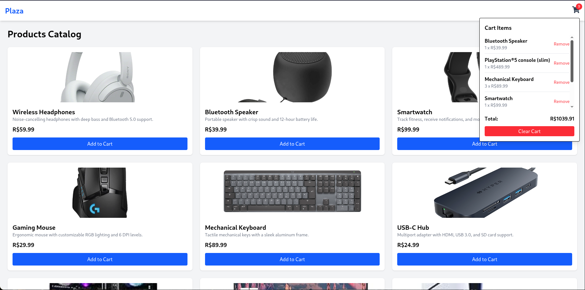

# 🛍️ Plaza — React E-Commerce UI

Plaza is a modern, responsive e-commerce interface built with **React** as part of my learning journey. It simulates a shopping experience with full cart functionality, leveraging **React's useContext**, **TailwindCSS**, and a **mock local server**.

This project demonstrates my ability to build clean, scalable, and responsive interfaces — and to handle real-world app logic like state management and user interaction.

<p align="center">
  
</p>


## 🚀 Features

- 🧠 **State Management with useContext** for global cart state
- 🖼️ **Responsive design** built entirely with **TailwindCSS**
- 🛒 **Dynamic cart dropdown** with item tracking and total calculation
- 🧹 "Clear Cart" and **individual item removal**
- 🌍 Clean and semantic React component structure
- ⚡ **Fast development workflow** with local JSON server (mock API)
- 📱 Mobile-friendly layout & styling

## 🧪 Tech Stack

- **React**
- **TailwindCSS**
- **React useContext**
- **JSON Server**
- **JavaScript (ES6+)**

## 📚 Learning Goals

This project was created to solidify my understanding of:

- Context API for shared state
- Tailwind utility-first CSS
- Component-based architecture
- Responsive layout strategies
- Managing cart behavior and UI logic

## 🧩 How to run
This project is using local server (json-server).
Open a terminal tab and run the following.
```bash
npm i
npm run dev
```

Open another terminal tab to run the local server.
In this local server we can do all CRUD operations.

```bash
# This is cutomizable. Go to package and add new script.
npm run json-server
```

## How to set up
Don't run this. This meant for future reference.
```bash
# Install it as dev dependency, as it's not meant to prodution
npm i -D json-server

npm i tailwindcss @tailwindcss/vite
npm i react-icons

```

Create a new `data` folder with a file called `db.json`.

Now create a new script to run local server. Additionaly it's good to use Postman.

In `package.json` add a new script - the port can be any value:
```json
"json-server": "json-server src/data/db.json --port 5000"
```
